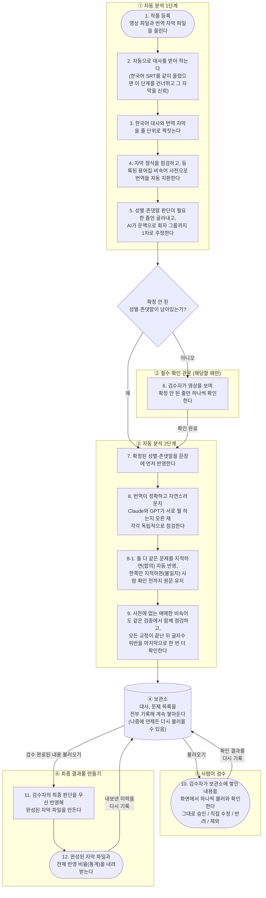
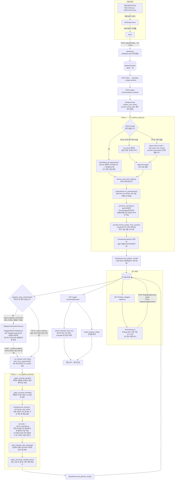
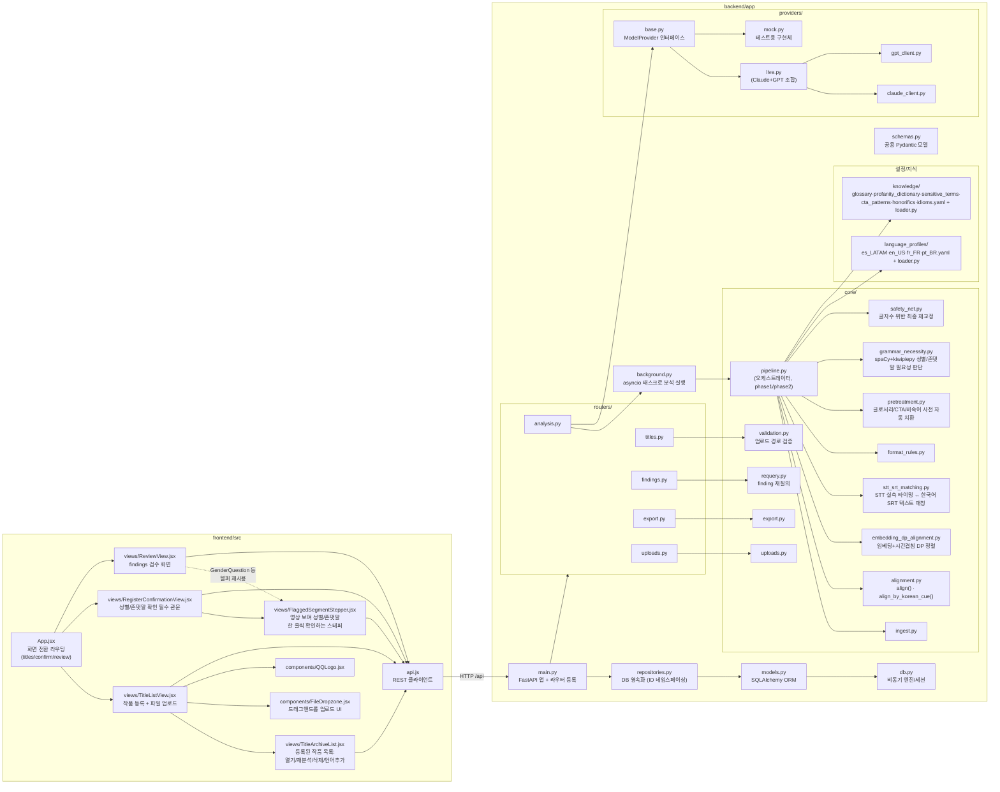
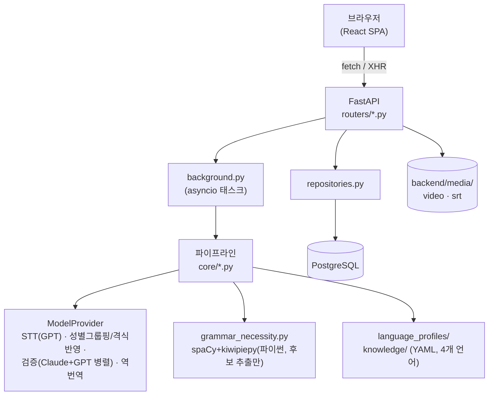

# Sub Translation QC

한국어 원본 영상과 번역 자막(SRT, 현재 스페인어 LATAM·영어·프랑스어·포르투갈어 지원)을 입력받아, STT·정렬·포맷·번역품질·민감어를 자동으로 점검하고 사람이 검수해 최종 SRT를 내보내는 자막 QC 도구입니다.

- **백엔드**: FastAPI + SQLAlchemy(async) + PostgreSQL + Alembic. 분석은 별도 워커 없이 FastAPI 프로세스 안 `asyncio` 백그라운드 태스크로 돕니다(`background.py`).
- **프론트엔드**: React 19 + Vite + Tailwind.
- **모델 연동**: `ModelProvider` 추상 인터페이스. Claude(Anthropic)·GPT(OpenAI)를 쓰는 `LiveModelProvider`가 실제 운영 경로이고, 테스트 전용 `MockProvider`가 있습니다. 성별/격식(존댓말·반말) 판단이 필요한 **후보 줄을 거르는 것**은 LLM이 아니라 spaCy(대상언어)+kiwipiepy(한국어) 형태소 분석으로 처리하지만, 실제 화자별 성별/격식 그룹은 Claude/GPT가 전후 문맥을 보고 1차로 추정합니다 — 그래도 AI가 확신 못한 줄은 검수자가 영상을 보고 직접 확정해야 하며, **이 확정이 끝나야만 다음 단계인 번역 품질 이중검증이 시작됩니다.**

## 목차

- [전체 흐름 한눈에 보기](#전체-흐름-한눈에-보기)
- [전체 파이프라인](#전체-파이프라인)
- [프로젝트 구조](#프로젝트-구조)
- [아키텍처 레이어](#아키텍처-레이어)
- [실행 방법](#실행-방법)
- [배포](#배포)
- [알려진 제약](#알려진-제약)

## 전체 흐름 한눈에 보기

이 도구가 실제로 무슨 일을 하는지, 개발 지식 없이도 이해할 수 있도록 정리한 그림입니다.



**요약하면:**
1. **① 자동 분석 1단계** — 영상과 자막을 올리면 대사를 받아 적고(또는 한국어 SRT를 신뢰하고) 번역과 맞춰본 뒤, 형식을 점검하고 용어집/비속어 사전을 자동 반영하며, 성별·존댓말 판단이 필요한 줄을 찾아 AI가 화자 그룹까지 1차로 추정합니다.
2. **② 필수 확인 관문** — AI가 확신하지 못해 남겨둔 성별·존댓말이 하나라도 있으면, 검수자가 영상을 보며 반드시 먼저 확정합니다. 확정 전에 번역 품질 검증을 돌리면 성별·존댓말을 추측한 채로 검증하게 되므로, 이 단계가 끝나야만 다음 단계로 넘어갑니다. 처음부터 확정이 필요 없으면(전부 자동 판정됨) 이 단계는 건너뜁니다.
3. **③ 자동 분석 2단계** — 확정된 성별·존댓말을 문장에 반영한 뒤, Claude와 GPT가 같은 원문을 각자 독립적으로 검토해 번역 품질과 민감어를 점검합니다. 둘이 동의한 것만 자동 반영하고, 의견이 갈리면 사람 확인 전까지 원문을 그대로 둡니다.
4. **④ 보관소** — 이 목록은 전부 한곳에 기록해 쌓아두기 때문에, 나중에 언제 다시 열어도 이어서 검수할 수 있습니다.
5. **⑤ 사람이 검수** — 검수자는 보관소에 쌓인 내용을 불러와 승인/수정/반려하거나, 불필요한 줄은 최종 결과물에서 제외 표시합니다.
6. **⑥ 최종 결과물 만들기** — 검수가 끝난 내용을 불러와 검수자의 판단을 우선 반영한 최종 자막 파일을 만들고, 언제·얼마나 반영해서 내보냈는지 이력도 보관소에 남깁니다.

즉 "자동 분석해서 쌓아두기"와 "그걸 사람이 검수해서 최종 파일로 뽑아내기"는 서로 다른 단계이며, 그 사이를 **보관소**가 이어줍니다.

## 전체 파이프라인

작품 등록부터 최종 SRT 내보내기까지 전체 흐름입니다(개발자용). `run-analysis`가 호출되면 `background.py`의 `analyze_and_save()`가 `backend/app/core/pipeline.py`의 `run_pipeline_phase1()`을 실행하고, 성별/존댓말 확인이 필요 없으면 곧장, 필요하면 검수자 확인 후 `run_pipeline_phase2()`를 이어서 실행합니다.



**핵심 설계 포인트**

- 한국어 SRT를 같이 올리면 STT를 아예 돌리지 않습니다(영상 동기화 확인용 짧은 클립 STT 제외). 이후 모든 검사는 텍스트(정렬된 pair) 기준으로 동작합니다.
- 온점(ellipsis) 자동보정은 원본 텍스트로 먼저 위반을 감지·기록한 뒤 적용해, 무엇이 왜 바뀌었는지 추적할 수 있습니다.
- **성별/격식(존댓말·반말)은 spaCy+kiwipiepy가 "판단이 필요한 후보"만 걸러내고, Claude/GPT가 전후 문맥으로 화자 그룹·성별을 1차 추정합니다.** 그래도 AI가 확신 못한 줄은 검수자가 영상을 보고 직접 확정해야 하며, **이 확정이 끝나기 전엔 다음 단계(번역 품질 이중검증)가 시작되지 않습니다** — 성별/격식을 추측한 채로 번역 품질을 검증할 수는 없기 때문입니다. 같은 작품의 다른 회차/언어판에서 이미 확인된 캐릭터 성별은 `CharacterGenderFact`로 재사용됩니다.
- **Claude/GPT는 순차적으로 서로의 결과를 이어받지 않고, 같은 원문을 동시에 독립적으로 검증합니다.** 검수자가 대상언어를 몰라도 운영 가능해야 하므로, 두 모델의 일치 여부가 신뢰도 신호가 됩니다 — 둘 다 지적한 합의 후보도 다시 교차 확인(equivalence check)을 거쳐야 진짜 합의로 확정되어 자동 적용되고, 원문보다 나아지지 않았다고 판정된 교정은 합의여도 폐기됩니다. 의견이 갈리면 원문을 유지한 채 반대쪽 모델의 한국어 역번역을 참고용으로 붙여 사람이 판단할 근거를 남깁니다.
- Export 시 같은 세그먼트에 자동보정과 검수자 판단이 동시에 걸리면 **검수자 판단이 항상 우선**하며(`reviewed_at` 유무로 정렬), 검수자가 "제외" 표시한 세그먼트(`Segment.excluded`)는 최종 SRT에서 빠집니다.

## 프로젝트 구조



| 경로 | 역할 |
|---|---|
| `backend/app/main.py` | FastAPI 앱 생성 + 라우터 등록 |
| `backend/app/background.py` | 분석을 FastAPI 프로세스 안 `asyncio.create_task`로 실행 (별도 워커 없음), phase1/phase2 오케스트레이션, STT 캐시 관리 |
| `backend/app/routers/titles.py` | 작품/에피소드 등록, 언어 프로필 목록, 캐릭터 성별 확정(`PATCH /character-genders/{id}`) |
| `backend/app/routers/analysis.py` | target-version 생성, run-analysis, 재분석, 성별/격식 확인 완료(`confirm-registers`) |
| `backend/app/routers/findings.py` | findings/segments 조회, 검수 액션, 성별/격식(그룹) 확정, 세그먼트 제외, requery, STT 교정 |
| `backend/app/routers/export.py` | 최종 SRT 조립 + 반영율 통계 |
| `backend/app/routers/uploads.py` | 영상/SRT(한국어 포함) 업로드 |
| `backend/app/core/pipeline.py` | 분석 파이프라인 오케스트레이터 (`run_pipeline_phase1` / `run_pipeline_phase2`) |
| `backend/app/core/ingest.py` | SRT 파싱/조립, 영상→오디오 추출, 오디오 조각 분할, 원본 영상 삭제 |
| `backend/app/core/alignment.py` | 단어 단위 정렬(`align`), 한국어 큐 기준 Union-Find 그룹핑(`align_by_korean_cue`), 전역 오프셋 탐지 |
| `backend/app/core/embedding_dp_alignment.py` | 한국어 SRT가 있을 때 STT 없이 임베딩 코사인유사도 + 시간겹침 DP로 직접 정렬 |
| `backend/app/core/stt_srt_matching.py` | 영상 동기화 확인용 STT 실측 타이밍에 한국어 SRT 텍스트를 매칭 |
| `backend/app/core/format_rules.py` | 줄 길이/연속 온점 등 언어 무관 포맷 규칙 |
| `backend/app/core/pretreatment.py` | 등록된 글로서리·CTA 문구·비속어 사전 자동 치환 (LLM 없음) |
| `backend/app/core/grammar_necessity.py` | spaCy(대상언어)+kiwipiepy(한국어)로 성별/격식 판단이 필요한 후보만 판별, 확정된 값을 문장에 반영 |
| `backend/app/core/safety_net.py` | 모든 교정 후 글자수 위반 최종 재교정 |
| `backend/app/core/requery.py` | 검수자 지시사항 반영한 finding 재질의 |
| `backend/app/core/validation.py` | 한국어 SRT 경로가 MEDIA_ROOT/srt_ko 하위인지 검증 (path traversal 방지, `titles.py` 등록 시 호출) |
| `backend/app/core/export.py` | 최종 SRT 조립 + 반영율 통계, 제외(excluded) 세그먼트 건너뛰기 |
| `backend/app/core/uploads.py` | 업로드 파일을 경로 조작 없이 디스크에 저장 |
| `backend/app/repositories.py` | 파이프라인 결과 DB 영속화 (target_version별 ID 네임스페이싱), 캐릭터 성별 재사용 조회 |
| `backend/app/models.py` / `db.py` / `schemas.py` | ORM 테이블(`CharacterGenderFact` 포함) / DB 엔진·세션 / 공용 데이터 모델 |
| `backend/app/language_profiles/` | 언어별 설정 (YAML: `es_LATAM`, `en_US`, `fr_FR`, `pt_BR`) |
| `backend/app/knowledge/` | 글로서리·비속어 사전·민감어·CTA·존댓말·관용구 목록 (YAML) |
| `backend/app/providers/base.py` | `ModelProvider` 추상 인터페이스 |
| `backend/app/providers/claude_client.py` / `gpt_client.py` | Claude/GPT API 얇은 SDK 래퍼 (검증 + 성별 그룹핑 + 격식 반영 + 역번역) |
| `backend/app/providers/live.py` | Claude+GPT를 묶는 실제 운영 프로바이더 |
| `backend/app/providers/mock.py` | 테스트용 결정론적 구현체 |
| `frontend/src/views/TitleListView.jsx` | 작품 등록 + 영상/SRT 드래그앤드롭 업로드 화면 (아래에 `TitleArchiveList` 렌더링) |
| `frontend/src/views/TitleArchiveList.jsx` | 등록된 작품 아카이브 목록 — 이어서 검토/재분석/삭제, 회차별 언어 버전 추가 |
| `frontend/src/views/RegisterConfirmationView.jsx` | 분석 직후, AI 검증 전에 반드시 거치는 성별/격식 확인 필수 단계 |
| `frontend/src/views/ReviewView.jsx` | findings 검수, STT 교정, 세그먼트 제외, export 화면 |
| `frontend/src/views/FlaggedSegmentStepper.jsx` | 영상 보며 성별/격식 한 줄씩 확인하는 풀스크린 스테퍼 (ReviewView도 일부 헬퍼 재사용) |
| `frontend/src/components/FileDropzone.jsx` | 재사용 가능한 드래그앤드롭/클릭 업로드 컴포넌트 |
| `frontend/src/components/QQLogo.jsx` | 로고 컴포넌트 |
| `frontend/src/api.js` | 백엔드 REST API 클라이언트 (업로드는 XHR로 진행률 지원) |

## 아키텍처 레이어



## 실행 방법

### 백엔드

```bash
cd backend
venv/bin/uvicorn app.main:app --reload
```

DB 마이그레이션이 필요한 경우:

```bash
cd backend
venv/bin/alembic upgrade head
```

### 프론트엔드

```bash
cd frontend
npm run dev
```

`frontend/vite.config.js`가 `/api`, `/media`를 `localhost:8000`(백엔드)으로 프록시하므로 별도 설정 없이 바로 연동됩니다.

### 테스트

```bash
cd backend && venv/bin/pytest -q
cd frontend && npm run build && npm run lint
```

## 배포

프로덕션은 Docker Compose로 `backend` + `frontend`(Caddy) + `postgres` 세 컨테이너를 함께 띄웁니다.

```bash
docker compose up -d --build
```

- `backend/Dockerfile`: `python:3.14-slim` + ffmpeg, 기동 시 `alembic upgrade head` 후 `uvicorn` 실행. 컨테이너 포트는 `127.0.0.1:8000`에만 바인딩(외부 직접 노출 안 함).
- `frontend/Dockerfile` + `frontend/Caddyfile`: 정적 빌드를 **Caddy**(이전 nginx에서 전환)가 서빙 — HTTPS 인증서 자동 발급, Basic Auth, `/api/*`·`/media/*`를 backend로 리버스프록시, SPA fallback까지 한 번에 처리.
- `postgres`: 호스트에 포트를 노출하지 않고 Docker 내부망으로만 접근.
- AWS EC2 프리티어 기준 최초 세팅 스크립트(`deploy/ec2-bootstrap.sh`, 스왑 4GB 생성 + Docker 설치)와 전체 배포 런북은 [`deploy/README.md`](deploy/README.md) 참고.

## 알려진 제약

- **spaCy 언어별 모델 + kiwipiepy 필요**: `grammar_necessity.py`가 대상언어별 spaCy 모델(`es_core_news_sm`, `pt_core_news_sm`, `en_core_web_sm`, `fr_core_news_lg`)과 한국어 형태소 분석기 `kiwipiepy`를 씁니다. `requirements.txt`에 고정 wheel URL로 포함돼 있어 `pip install -r requirements.txt`만으로 같이 설치됩니다. `fr_core_news_lg`는 약 600MB로 커서 저사양 서버(예: EC2 t3.micro, RAM 1GB)에서 메모리 부족이 날 수 있어 `deploy/ec2-bootstrap.sh`가 스왑을 만들어둡니다.
- **성별/격식 확정 전엔 번역 품질 검증(AI 이중검증)이 시작되지 않음**: `status="awaiting_confirmation"` 상태에서 검수자가 확인을 마치지 않고 화면을 나가면, 다시 들어와 확인을 끝내야만 다음 단계가 진행됩니다(자동으로 넘어가지 않음).
- **Claude/GPT 합의 없는 교정은 자동 적용되지 않음**: 검수자가 대상언어를 몰라도 운영 가능해야 한다는 전제로, 두 모델이 같은 줄을 지적하고 교차 확인까지 통과해야만 자동 반영됩니다. 한쪽만 지적한 경우는 원문이 유지된 채 역번역만 참고용으로 남고, 실제 반영 여부는 사람이 판단할 근거가 부족할 수 있습니다.
- **원본 영상은 최초 분석(Phase 1) 성공 직후 삭제되고 재업로드 경로가 없음**: 이후 재분석이나 언어 추가는 그때 저장해둔 STT 캐시(`Episode.stt_cache`)와 영상 프록시(`video_proxy_path`)에 의존합니다. 캐시가 없는 상태에서 원본까지 없으면 재분석이 실패합니다.
- **개발용 DB와 테스트 DB가 동일 인스턴스를 공유**: `pytest` 실행 시 테스트 픽스처가 테이블을 `drop_all`하면서 개발 중 등록한 데이터가 함께 사라질 수 있습니다. 복구는 `cd backend && venv/bin/alembic stamp base && venv/bin/alembic upgrade head`로 가능하며, 근본적으로는 테스트 DB를 분리하는 것이 권장됩니다(아직 미적용).
