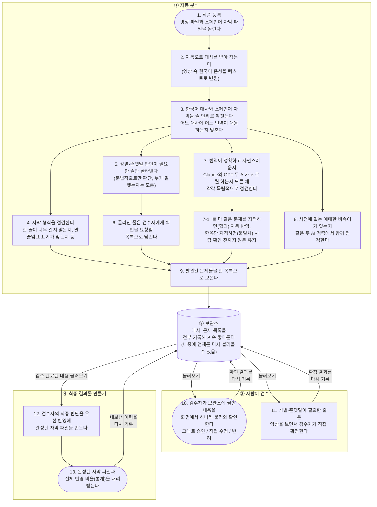
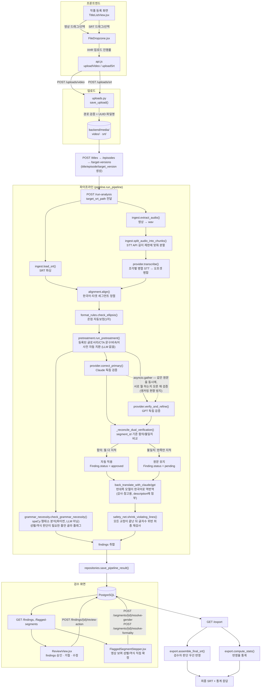
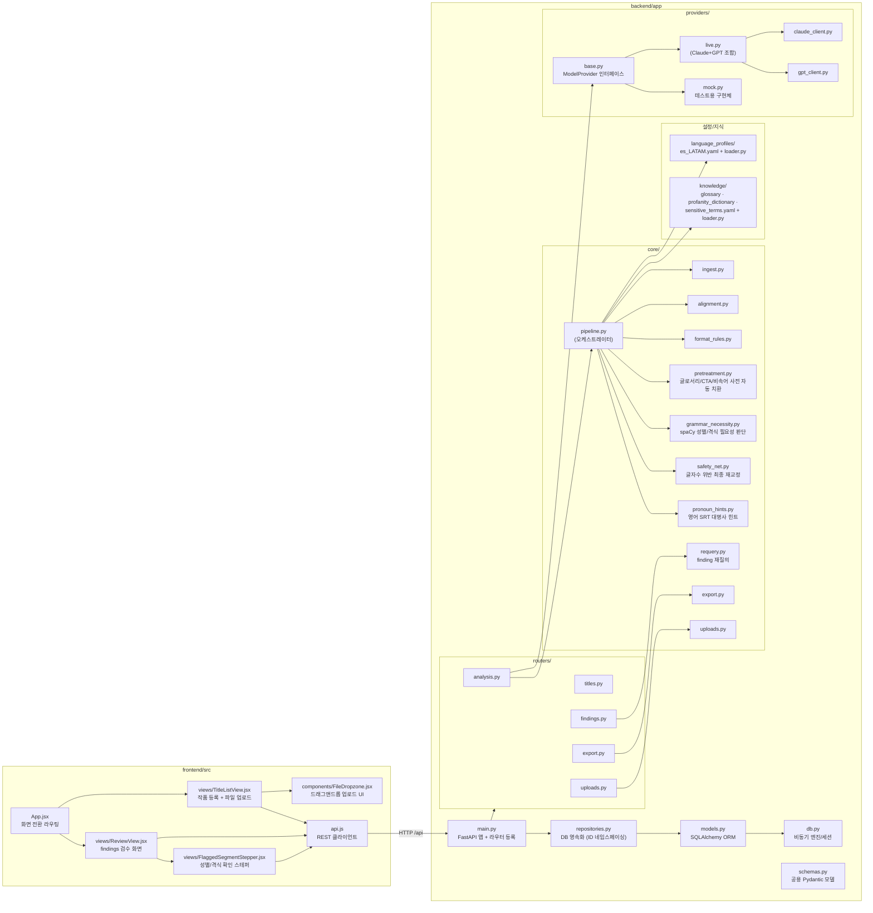
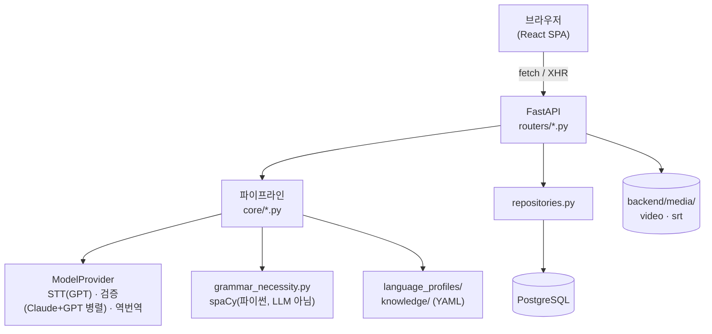

# Sub Translation QC (ES)

한국어 원본 영상과 스페인어(LATAM) 번역 자막(SRT)을 입력받아, STT·정렬·포맷·번역품질·민감어를 자동으로 점검하고 사람이 검수해 최종 SRT를 내보내는 자막 QC 도구입니다.

- **백엔드**: FastAPI + SQLAlchemy(async) + PostgreSQL + Alembic
- **프론트엔드**: React 19 + Vite + Tailwind
- **모델 연동**: `ModelProvider` 추상 인터페이스. Claude(Anthropic)·GPT(OpenAI)를 쓰는 `LiveModelProvider`가 실제 운영 경로이고, 테스트 전용 `MockProvider`가 있습니다. 성별/격식(존댓말·반말) 판단이 필요한 줄을 거르는 문법 필요성 체크는 LLM이 아니라 spaCy 형태소 분석(파이썬)으로 처리합니다.

## 목차

- [전체 흐름 한눈에 보기](#전체-흐름-한눈에-보기)
- [전체 파이프라인](#전체-파이프라인)
- [프로젝트 구조](#프로젝트-구조)
- [아키텍처 레이어](#아키텍처-레이어)
- [실행 방법](#실행-방법)
- [알려진 제약](#알려진-제약)

## 전체 흐름 한눈에 보기

이 도구가 실제로 무슨 일을 하는지, 개발 지식 없이도 이해할 수 있도록 정리한 그림입니다.



**요약하면:**
1. **① 자동 분석** — 영상과 자막을 올리면 시스템이 대사를 받아 적고, 번역을 서로 맞춰본 뒤 형식·번역품질·민감어 문제를 자동으로 찾아 목록으로 정리합니다. 번역 품질은 Claude와 GPT가 같은 원문을 각자 독립적으로 검토해, 둘이 동의한 것만 자동 반영하고 의견이 갈리면 사람 확인 전까지 원문을 그대로 둡니다.
2. **② 보관소** — 이 목록은 전부 한곳에 기록해 쌓아두기 때문에, 나중에 언제 다시 열어도 이어서 검수할 수 있습니다.
3. **③ 사람이 검수** — 검수자는 보관소에 쌓인 내용을 불러와 승인/수정/반려하고, 성별·존댓말처럼 영상을 봐야 아는 판단은 직접 확정합니다. 그 판단은 다시 보관소에 기록됩니다.
4. **④ 최종 결과물 만들기** — 검수가 끝난 내용을 불러와 검수자의 판단을 우선 반영한 최종 자막 파일을 만들고, 언제·얼마나 반영해서 내보냈는지 이력도 보관소에 남깁니다.

즉 "자동 분석해서 쌓아두기"와 "그걸 사람이 검수해서 최종 파일로 뽑아내기"는 서로 다른 단계이며, 그 사이를 **보관소**가 이어줍니다.

## 전체 파이프라인

작품 등록부터 최종 SRT 내보내기까지 전체 흐름입니다(개발자용). `run-analysis`가 호출되면 `backend/app/core/pipeline.py`의 `run_pipeline()`이 아래 단계를 순서대로 오케스트레이션합니다.



**핵심 설계 포인트**

- 오디오는 STT 단계에서 **딱 한 번만** 사용되고, 이후 모든 검사는 텍스트(정렬된 pair) 기준으로 동작합니다.
- 온점(ellipsis) 자동보정은 원본 텍스트로 먼저 위반을 감지·기록한 뒤 적용해, 무엇이 왜 바뀌었는지 추적할 수 있습니다.
- **Claude/GPT는 순차적으로 서로의 결과를 이어받지 않고, 같은 원문을 동시에 독립적으로 검증합니다.** 검수자가 스페인어를 몰라도 운영 가능해야 하므로, 두 모델의 일치 여부가 신뢰도 신호가 됩니다 — 합의된 교정만 자동 적용되고, 의견이 갈리면 원문을 유지한 채 반대쪽 모델의 한국어 역번역을 참고용으로 붙여 사람이 판단할 근거를 남깁니다.
- 성별/격식(존댓말·반말)은 화자를 텍스트만으로 특정할 근거가 없어 Claude/GPT 어느 쪽도 판단하지 않습니다. spaCy로 "판단이 필요한 줄인지"만 걸러내고, 실제 값은 검수자가 영상을 보고 직접 확정합니다.
- Export 시 같은 세그먼트에 자동보정과 검수자 판단이 동시에 걸리면 **검수자 판단이 항상 우선**합니다 (`reviewed_at` 유무로 정렬).

## 프로젝트 구조



| 경로 | 역할 |
|---|---|
| `backend/app/main.py` | FastAPI 앱 생성 + 라우터 등록 |
| `backend/app/routers/titles.py` | 작품/에피소드 등록, 언어 프로필 목록 |
| `backend/app/routers/analysis.py` | target-version 생성, run-analysis(파이프라인 실행) |
| `backend/app/routers/findings.py` | findings/segments 조회, 검수 액션, 성별/격식 확정, requery, STT 교정 |
| `backend/app/routers/export.py` | 최종 SRT 조립 + 반영율 통계 |
| `backend/app/routers/uploads.py` | 영상/SRT 업로드 |
| `backend/app/core/pipeline.py` | 분석 파이프라인 오케스트레이터 |
| `backend/app/core/ingest.py` | SRT 파싱/조립, 영상→오디오 추출, 오디오 조각 분할 |
| `backend/app/core/alignment.py` | 한국어 STT ↔ 대상언어 자막 타임코드 정렬 |
| `backend/app/core/format_rules.py` | 줄 길이/연속 온점 등 언어 무관 포맷 규칙 |
| `backend/app/core/pretreatment.py` | 등록된 글로서리·CTA 문구·비속어 사전 자동 치환 (LLM 없음) |
| `backend/app/core/grammar_necessity.py` | spaCy 형태소 분석으로 성별/격식 판단이 필요한 줄만 판별 (LLM 아님) |
| `backend/app/core/safety_net.py` | 모든 교정 후 글자수 위반 최종 재교정 |
| `backend/app/core/pronoun_hints.py` | 영어 SRT 대조로 성별 확인용 대명사 힌트 계산 |
| `backend/app/core/requery.py` | 검수자 지시사항 반영한 finding 재질의 |
| `backend/app/core/export.py` | 최종 SRT 조립 + 반영율 통계 |
| `backend/app/core/uploads.py` | 업로드 파일을 경로 조작 없이 디스크에 저장 |
| `backend/app/repositories.py` | 파이프라인 결과 DB 영속화 (target_version별 ID 네임스페이싱) |
| `backend/app/models.py` / `db.py` / `schemas.py` | ORM 테이블 / DB 엔진·세션 / 공용 데이터 모델 |
| `backend/app/language_profiles/` | 언어별 설정 (YAML, 현재 `es_LATAM`) |
| `backend/app/knowledge/` | 글로서리·비속어 사전·민감어 목록 (YAML) |
| `backend/app/providers/base.py` | `ModelProvider` 추상 인터페이스 |
| `backend/app/providers/claude_client.py` / `gpt_client.py` | Claude/GPT API 얇은 SDK 래퍼 (검증 + 역번역) |
| `backend/app/providers/live.py` | Claude+GPT를 묶는 실제 운영 프로바이더 |
| `backend/app/providers/mock.py` | 테스트용 결정론적 구현체 |
| `frontend/src/views/TitleListView.jsx` | 작품 등록 + 영상/SRT 드래그앤드롭 업로드 화면 |
| `frontend/src/views/ReviewView.jsx` | findings 검수, STT 교정, export 화면 |
| `frontend/src/views/FlaggedSegmentStepper.jsx` | 영상 보며 성별/격식 한 줄씩 확인하는 풀스크린 스테퍼 |
| `frontend/src/components/FileDropzone.jsx` | 재사용 가능한 드래그앤드롭/클릭 업로드 컴포넌트 |
| `frontend/src/api.js` | 백엔드 REST API 클라이언트 (업로드는 XHR로 진행률 지원) |

## 아키텍처 레이어



## 실행 방법

### 백엔드

```bash
cd backend
venv/bin/uvicorn app.main:app --reload
```

DB 마이그레이션이 필요한 경우:

```bash
cd backend
venv/bin/alembic upgrade head
```

### 프론트엔드

```bash
cd frontend
npm run dev
```

### 테스트

```bash
cd backend && venv/bin/pytest -q
cd frontend && npm run build && npm run lint
```

## 알려진 제약

- **spaCy 스페인어 모델 필요**: `grammar_necessity.py`가 `es_core_news_sm`을 씁니다. `requirements.txt`에 고정 wheel URL로 포함돼 있어 `pip install -r requirements.txt`만으로 같이 설치됩니다.
- **Claude/GPT 합의 없는 교정은 자동 적용되지 않음**: 검수자가 스페인어를 몰라도 운영 가능해야 한다는 전제로, 두 모델이 같은 줄을 지적해야만 자동 반영됩니다. 한쪽만 지적한 경우는 원문이 유지된 채 역번역만 참고용으로 남고, 실제 반영 여부는 사람이 판단할 근거가 부족할 수 있습니다.
- **개발용 DB와 테스트 DB가 동일 인스턴스를 공유**: `pytest` 실행 시 테스트 픽스처가 테이블을 `drop_all`하면서 개발 중 등록한 데이터가 함께 사라질 수 있습니다. 복구는 `cd backend && venv/bin/alembic stamp base && venv/bin/alembic upgrade head`로 가능하며, 근본적으로는 테스트 DB를 분리하는 것이 권장됩니다(아직 미적용).
